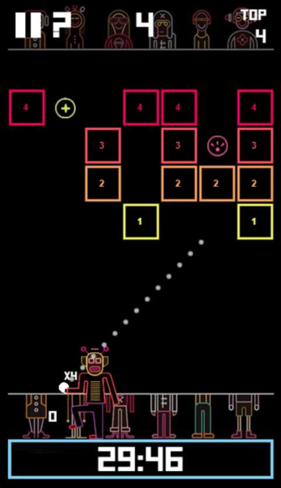

<h1 align="center">Gaál Botond prog3 házi feladat specifikáció: BBTAN</h1>
<h2 align="center">2024 őszi félév</h2>

  

  
 

## Bevezető, játékmenet

A BBTAN egy népszerű mobil játék, ezen házi feladat ennek a leegyszerűsített megvalósítása. A fedőlapon 
látható az eredeti játék képernyőfótója referencia végett. Ez természetesen nem reprezentatív a házi 
feladat végső kinézetére tekintve, csupán illusztráció.
A játék célja, hogy minél tovább "túléljen" a játékos, a pontszáma (amely alapján toplista számítható)
a "halál" előtt eltert körök száma. Minden körben a játéktér legfelső sorában új blokkok teremnek, és
minden kör elején az "élő" blokkok egy sorral lentebb kerülnek (így helyet hagyva az újaknak). A 
játéknak vége, amikor legalább egy blokk eléri a képernyő alját, amely a játékos szintje. A játékos
feladata tehát minden blokk elpusztítása, mielőtt alulra kerülnének (hasonlóan ahhoz, ahogy a tetrisben
a cél elkerülni a képernyő *tetejének* megérintését). A játékos fegyvere egy golyókat tároló ágyú, az 
input ennek az ágyúnak az iránya. Az ágyú minden esetben az összes golyót kilövi, ezek a golyók 
visszapattannak a képernyő oldalairól (kivéve az alsót), és a blokkokról. Amikor egy golyó visszapattan 
egy blokkról, a blokk életereje eggyel csökken, mikor nullára esik, elpusztul az érintett blokk. 
A képernyő alsó oldala kitüntetett, az ide érkező golyók visszakerülnek az ágyúba, egy körnek pedig akkor 
van vége, mikor az utolsó kilőtt golyó is visszaért a játékoshoz. Ekkor a játékos újra célozhat, arról a 
pontról, ahova az első visszaért golyó beérkezett. 

## A blokkok szabályai

A bevezetőnek megfelelően a blokkoknak éledésükkor meghatározott életereje van, amelyet egyesével egy-egy
golyó visszapattanásával lehet csökkenteni. Ez az életerő vagy pontosan annyi, ahanyadik körben megteremt
a blokk, vagy annak kétszerese. A kétszeres életű blokkok esélye konfigurálható, jellemzően jelentősen
alacsonyabb, mint a reguláris blokkoknak. A blokkok lehetnek négyzet alakúak, vagy egyenlő oldalú
derékszögű háromszögek. Ez utóbbi blokk típusból négy féle van, attól függően, hogyan kapható az
meg egy négyzet alakú blokkból. Azt, hogy hány blokk terem egy körben egy súlyfüggvény adja meg, 
de mindig legalább egy és maximum annyi, ahány elfér a felső sorban (helyet hagyva a később taglalt "+"
elemnek).

## Az ágyú szabályai, segítségek

A játékos számára két segítség biztosított, melyek az első érintés utáni körben eltűnnek (tehát egyetlen
körben használhatók csak).
1. Egy "szóró" elem, amely érintkezéskor egy véletlenszerű sebesség irányt ad az érintkező golyónak.
2. Egy "+" elem, amely a rendelkezésre álló golyók számát eggyel növeli az érintését követő körtől 
   kezdődően. Ilyen elem minden körben egyszer terem, így a játékos golyóinak száma lépést tart a blokkok
   növekvő életerejével.

A játékos egy golyóval kezdi a játékot, a célzást segíti egy előrejelző, amely az első pattanásig 
mutatja a golyó(k) irányát. A célzás minimális és maximális szöge a vízszintes síktól tekintve 30°-150°.

## Végtelen menet elkerülése

Mivel egy menetnek akkor van vége, mikor az utolsó kilőtt labda is visszatért a játékoshoz (azaz az ablak
alsó szélén kijutott a játékmezőről), lehetségesek végtelen (vagy legalábbis nagyon hosszú) körök, amelyek
a játékélményt elrontanák. Ezen végtelen körök megoldására két módszer adott:
1. Gyorsítás: a játékos gombnyomásra felgyorsíthatja a játék szimulációját, így egy hosszú kör
   gyorsabban lejátszható.
2. Extra "szóró" elem: **bizonyos idő eltelte után** a játékos szintén gombnyomásra egy szóró elemet
   tehet a golyók útjába (ezzel kimozdítva őket a visszapattanás hurokból amibe szorultak.)

## Mentések

Minden játékoshoz egy JSON formátumú profil fájl kerül mentésre, melyben számon van tartva:
1. Az eddigi high score-ja a felhasználónak.
2. A kétszeres blokkok termésének esélye.
3. A háromszög alakú blokkok termésének esélye.
4. Az újonnan termő blokkok számának súlyfüggvénye.
5. A szóró elem termésének esélye.

Ezen felül egy szintén egy JSON fájlban számon lehet tartani a játékállást,
tehát annak a tényét, hogy a játéktérben hol, milyen blokkok és egyéb elemek voltak, és mi volt
a játékos állása, beleértve a pontszámát, a golyóinak a számát, és a következő kör kezdőpontját.