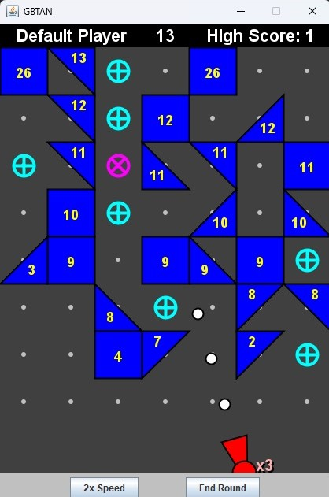

<h1 align="center">BBTAN User Manual</h1>
<h3 align="center">Gaál Botond Prog3 HF</h3>
<h3 align="center">2024 őszi félév</h3>

A programot fordítva és futtatva egy két lépéses főmenű fogadja a felhasználót:
1. Felhasználói profil választás. Két lehetőség van: a Default Profile-ra kattintva az alapértelmezett
beállításokkal kezdhetjük a játékot, a Load Profile-ra kattintva pedig az elmentett profilok közül 
tallózhatunk. Ahhoz, hogy továbblépjünk vagy sikeresen tallózni kell egy felhasználói profilt, vagy
a Default-ot használni. A felhasználói profilok tartalmazzák a játékos nevét, high score-ját, és az új
sorok termését szabályozó véletlenszám-generátor tulajdonságait.
2. Mentés választás. Szintén két lehetőség van: a Load Save-re kattintva korábban félbehagyott játékok,
azaz automatikusan létrejött mentések fájljai közül tudunk tallózni. A New Game-re kattintva pedig egy 
új játékot kezdhetünk. Hasonlóan az első szelekcióhoz, itt is el kell végezni a választást, mielőtt
tovább lépünk a játékra.

  

  
 

Miután betöltöttük a profilt és a mentést, kezdetét veszi a játék. A játék célja, hogy minél tovább
túléljen az ember, azáltal, hogy az ágyúval elpusztítsa a megjelenő blokkokat. Az új játék
blokkok nélkül kezdődik, hogy az irányítást kipróbálhassa a játékos: célozni az egérrel lehet, és
egérgomb kattintásra (pontosabban felengedésre) tüzel az ágyú. Az első utáni körökben mindig a legfelső
sorban blokkok fognak teremni, melyek életereje fel van tüntetve rajtuk. Mikor ezen blokkoknak neki
pattan egy ágyúgolyó, az ágyúgolyó visszapattan róluk, és pattanásonként eggyel csökken az életerejük.
Azon blokkok, amelyeknek életerejét még nem csökkentettük 0-ra (azzal, hogy meglőttük őket az ágyúval) 
egy adott kör végén, egy sorral lentebb csúsznak, így helyet hagyva a következő új sornak.
Addig tart egy játék, amíg egy blokk el nem éri az alsó sort, ahol az ágyú tartózkodik. 
Ekkor a játékos új játékot kezdhet a NEW GAME gombra kattinva. 
A blokkokon kívül segítségek állnak a játékos számára rendelkezésre: az ágyúban tárolt labdák számát növelő
cián (kék) plusz pont adó segítség, valamint a labdákat véletlenszerű irányokba szóró magenta (lila) segítség.
Ezek igénybe vételéhez el kell őket találni egy ágyúgolyóval. 
Ha a játékos már elsütötte az ágyút, de a kör túl lassan játszódik le, a kör felgyorsítására
két gomb szolgál, melyek csak akkor válnak elérhetővé, ha elkezdődött a kör. Először is fel lehet
gyorsítani a labdákat, így gyorsabban végig játszva a kört. Másodszor is véget lehet vetni a körnek, azonnal
a következő körre lépve, azonban ebben az esetben elesünk a potenciális ütközésektől. Mindkét
gomb (kör gyorsítás) körönként egyszer használható.  
A játékos neve, aktuális pontszáma (azaz a túlélt körök száma), és a hozzá számon tartott high score
a felső panelben láthatók. Ha egy játéknak úgy van vége (úgy éri el egy blokk az utolsó sort), hogy
a jelenlegi pontszám nagyobb mint a számon tartott high score, ez a tény úgy kerül feljegyzésre,
hogy a játékos profil fájlja fölül íródik (az új high score-al). 
A játékállás elmentésre kerül, ha a játékos (az ablak jobb felső sarkában található X-el) bezárja az ablakot.
A mentések a saves mappában találhatók meg, és az aktuális dátum-időpont azonosítja őket. Így tehát ha
félbe maradt egy játék, később folytatható.